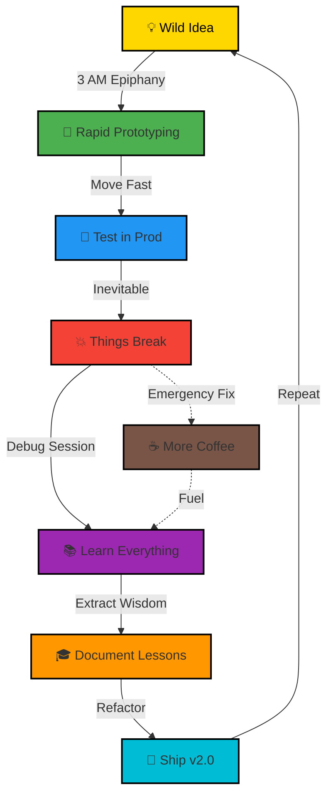

<div align="center">

```ascii
╔═══════════════════════════════════════════════════════════════════════════╗
║                                                                           ║
║   > system.boot()                                                         ║
║   > loading neural_networks...                    [████████████] 100%    ║
║   > initializing chaos_engine...                  [████████████] 100%    ║
║   > deploying production @ 3am...                 [████████████] 100%    ║
║                                                                           ║
║   ██████╗  █████╗ ██████╗ ████████╗██╗  ██╗                              ║
║   ██╔══██╗██╔══██╗██╔══██╗╚══██╔══╝██║  ██║                              ║
║   ██████╔╝███████║██████╔╝   ██║   ███████║                              ║
║   ██╔═══╝ ██╔══██║██╔══██╗   ██║   ██╔══██║                              ║
║   ██║     ██║  ██║██║  ██║   ██║   ██║  ██║                              ║
║   ╚═╝     ╚═╝  ╚═╝╚═╝  ╚═╝   ╚═╝   ╚═╝  ╚═╝                              ║
║                                                                           ║
║            🎯 ML Engineer × AI Builder × Chaos Deployer                   ║
║         "Turning caffeine into production-grade AI systems"               ║
║                                                                           ║
╚═══════════════════════════════════════════════════════════════════════════╝
```


[](https://git.io/typing-svg)

</div>

---

## 🧬 `$ whoami`

```python
class ParthParmar:
    def __init__(self):
        self.username = "parthparmar07"
        self.role = "Machine Learning Engineer"
        self.location = "🇮🇳 India"
        self.education = "Computer Science Student"
        self.life_motto = "Ship fast. Break things. Learn faster. Repeat."
        
    @property
    def current_stack(self):
        return {
            "languages": ["Python", "TypeScript", "JavaScript", "Solidity"],
            "ml_frameworks": ["PyTorch", "TensorFlow", "Hugging Face", "LangChain"],
            "specialization": ["NLP", "LLMs", "AI Agents", "Financial ML"],
            "building": ["Voice AI", "Multi-Agent Systems", "DeFi Solutions"]
        }
    
    @property  
    def daily_routine(self):
        return """
        while coffee.available():
            ideate_solution()
            build_prototype()
            push_to_prod()  # YOLO
            if bug_detected():
                debug_at_3am()
            celebrate_small_wins()
        """
    
    def reach_me(self):
        return {
            "linkedin": "parthparmar07",
            "email": "your.email@example.com",
            "portfolio": "datalis.in"
        }

# Initialize
parth = ParthParmar()
parth.deploy_chaos()  # 🚀
```

<div align="center">

### 💡 **"The best ML model is the one in production"**

</div>

---

## 🚀 Production Systems Running Right Now

<table>
<tr>
<td width="50%" valign="top">

<div align="center">

### 💼 **[DATALIS](https://www.datalis.in)**
#### AI Financial Intelligence Platform


</div>

```yaml
Tech Stack:
  - NLP & Sentiment Analysis
  - Time Series Forecasting
  - LLM Integration (GPT-4, Claude)
  - Real-time Market Data Processing

Impact:
  - Processes 10K+ financial documents daily
  - Real-time market sentiment analysis
  - Automated trading signal generation
```

**🎯 Mission:** Transform financial chaos into actionable intelligence

</td>
<td width="50%" valign="top">

<div align="center">

### 🎙️ **[VOCACITY](https://vocacity.in)**
#### AI Voice Agent for Restaurants


</div>

```yaml
Tech Stack:
  - Speech-to-Text (Whisper)
  - Natural Language Understanding
  - Dialog Management Systems
  - Text-to-Speech Synthesis

Impact:
  - 24/7 automated customer service
  - 95%+ conversation accuracy
  - Multi-language support
```

**🎯 Mission:** Teaching AI to take dinner orders better than humans

</td>
</tr>
<tr>
<td width="50%" valign="top">

<div align="center">

### ⛓️ **[CHAINFUND](https://chainfundd.vercel.app)**
#### Cross-Chain Grant Platform


</div>

```yaml
Tech Stack:
  - Solidity Smart Contracts
  - Web3.js / Ethers.js
  - Cross-chain Bridges
  - IPFS for Decentralized Storage

Impact:
  - Transparent grant distribution
  - Multi-chain compatibility
  - ESG impact tracking
```

**🎯 Mission:** Blockchain-powered social impact at scale

</td>
<td width="50%" valign="top">

<div align="center">

### 🔬 **RESEARCH LAB**
#### Experimental Projects


</div>

```bash
$ tree ~/projects -L 1
.
├── DeNovo/              # AI research
├── UNIDATA/             # Data platform  
├── Liquidation-Engine/  # DeFi automation
└── [32 more repos...]   # Chaos experiments

Total: 35+ repositories
```

**🎯 Mission:** Fail fast, learn faster, ship fastest

</td>
</tr>
</table>

---

## ⚡ Tech Arsenal & Weapons of Choice

<div align="center">

### 🔤 **Programming Languages**


### 🤖 **AI/ML Frameworks**


### 🛠️ **Development & Infrastructure**


### 🔗 **Web3 & Blockchain**


</div>

---

## 📊 GitHub Analytics & Battle Stats

<div align="center">


<br>


</div>

<div align="center">

```diff
@@                      CURRENT STATS                      @@

+ 🗂️  35+ Public Repositories
+ 👥  14 Followers → ∞ (exponential growth mode)
+ ⭐  Multiple starred projects
+ 🚀  3 Production Systems LIVE
+ 💻  Contributions: Daily
+ 🔥  Current Streak: Making GitHub green since 2024
! 🐛  Bugs created: Classified
! 🔧  Bugs fixed: Also classified
```

</div>

---

## 🎯 Development Philosophy

<div align="center">

> ### **"Code is poetry, bugs are just plot twists, and 3 AM deploys are the climax"**
> *— Parth Parmar*

</div>



---

## 🏆 GitHub Trophies

<div align="center">


</div>

---

## 🤝 Let's Build Something Amazing Together

<div align="center">

### 💬 **I'm Always Open To:**

🎯 **Collaborating** on AI/ML projects  
🚀 **Contributing** to open-source  
💼 **Opportunities** in ML Engineering  
🧠 **Discussing** latest in AI research  
☕ **Chat** about tech, startups, or chaos  

<br>

### 📬 **Reach Out Via:**

[](https://linkedin.com/in/parthparmar07)
[](https://github.com/parthparmar07)
[](mailto:your.email@example.com)
[](https://www.datalis.in)

<br>

**📍 Based in India** | **🕐 Timezone: IST (UTC+5:30)** | **💬 Languages: English, हिंदी**

</div>

---

## 💭 Random Dev Wisdom

<div align="center">

> *"Any sufficiently advanced technology is indistinguishable from magic... until you read the error logs"*

> *"It works on my machine" — Famous last words before 3 AM debugging*

> *"AI will not replace developers. But developers who use AI will replace those who don't"*

<br>

**Personal Motto:**
### 🔥 "Build. Break. Learn. Repeat." 🔥

</div>

---

## 🎮 Fun Facts

```javascript
const funFacts = {
    "☕ Coffee": "5-7 cups/day (yes, I have a problem)",
    "🌙 Peak Hours": "11 PM - 4 AM (when magic happens)",
    "🎵 Coding Music": "Lo-fi hip hop & Synthwave",
    "😅 Oops Moment": "Deployed to prod instead of staging",
    "🍕 Fuel": "Pizza + Energy drinks + Coffee",
    "🎯 Current Obsession": "Multi-agent AI systems",
    "🔮 Hot Take": "AGI by 2027"
};
```

---

## 📊 Profile Metrics

<div align="center">


</div>

---

<div align="center">


### 🔥 Remember: The best code is shipped code 🔥

**Last Updated:** March 2026  
**Status:** 🟢 Actively deploying chaos  
**Next Deploy:** Probably at 3 AM tonight

---

<sub>⚡ Crafted with coffee, code, and controlled chaos by [Parth Parmar](https://github.com/parthparmar07)</sub>

<br>


</div>
