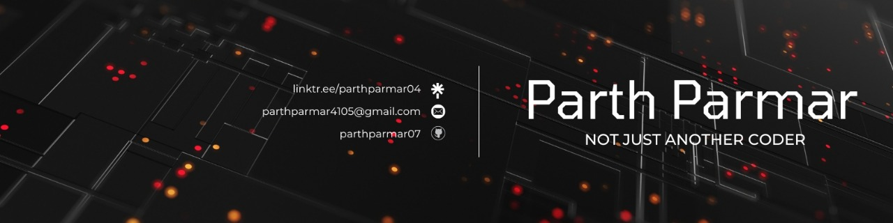

<!-- 🌌 Custom Banner -->
<p align="center">
  
</p>

---

<div align="center">

### Computer Science Student | Machine Learning Engineer | AI Agent Builder  

Building intelligent systems that **analyze, predict, and automate** —  
turning **data into decisions** and **ideas into impact**.

</div>

---

## 🚀 SYSTEM STATUS

```
╔═══════════════════════════════════════════════════════════════════════════╗
║                                                                           ║
║   STATUS: ONLINE    │    LATENCY: <50ms    │    UPTIME: 99.9%            ║
║   ┌─────────────────────────────────────────────────────────────────┐    ║
║   │ ████████████████████████████████████████████          [92%]     │    ║
║   └─────────────────────────────────────────────────────────────────┘    ║
║                                                                           ║
║   ██████╗  █████╗ ██████╗ ████████╗██╗  ██╗                              ║
║   ██╔══██╗██╔══██╗██╔══██╗╚══██╔══╝██║  ██║                              ║
║   ██████╔╝███████║██████╔╝   ██║   ███████║                              ║
║   ██╔═══╝ ██╔══██║██╔══██╗   ██║   ██╔══██║                              ║
║   ██║     ██║  ██║██║  ██║   ██║   ██║  ██║                              ║
║   ╚═╝     ╚═╝  ╚═╝╚═╝  ╚═╝   ╚═╝   ╚═╝  ╚═╝                              ║
║                                                                           ║
║   ROLE: AI Engineer & Systems Architect                                  ║
║   SPECIALIZATION: High-performance ML systems at scale                   ║
║   STACK: PyTorch | TensorFlow | LangChain | Kubernetes                   ║
║                                                                           ║
╚═══════════════════════════════════════════════════════════════════════════╝
```

---

## 📊 SYSTEM METRICS

<br>

<p align="center">
  
</p>

<br>

<p align="center">
  
  
</p>

<p align="center">
  
  
</p>

---

## 🔥 Highlights

<div align="center">


</div>

---

## 📈 GitHub Activity (Alternate Theme)

<p align="center">
  
</p>

---

## 💻 Most Used Languages (Filtered)

<p align="center">
  
</p>

> Calculated by **repository size**, not skill level.

<p align="center">
  
</p>

---

## 🚀 Featured Projects

### **Datalis — AI Financial Intelligence Platform**
https://www.datalis.in  

### **Vocacity — AI Voice Agent for Restaurants**
https://vocacity.in  

### **ChainFund — Cross-Chain Grant & ESG Platform**
https://chainfundd.vercel.app  

---

## 🤝 Connect With Me

<p align="center">
  <a href="https://github.com/parthparmar07">
    
  </a>
  <a href="https://linkedin.com/in/parthparmar07">
    
  </a>
</p>
