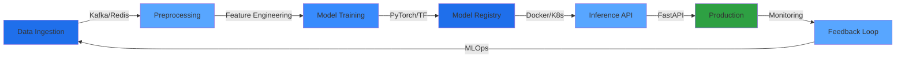

<div align="center">

```ascii
╔═══════════════════════════════════════════════════════════════════════════╗
║                                                                           ║
║   > ssh parth@neural.network                                              ║
║   > loading ml_pipelines...                   [████████████] 100%         ║
║   > compiling production_systems...           [████████████] 100%         ║
║   > deploying chaos_v2.0...                   [████████████] 100%         ║
║                                                                           ║
║   ██████╗  █████╗ ██████╗ ████████╗██╗  ██╗                              ║
║   ██╔══██╗██╔══██╗██╔══██╗╚══██╔══╝██║  ██║                              ║
║   ██████╔╝███████║██████╔╝   ██║   ███████║                              ║
║   ██╔═══╝ ██╔══██║██╔══██╗   ██║   ██╔══██║                              ║
║   ██║     ██║  ██║██║  ██║   ██║   ██║  ██║                              ║
║   ╚═╝     ╚═╝  ╚═╝╚═╝  ╚═╝   ╚═╝   ╚═╝  ╚═╝                              ║
║                                                                           ║
║            AI Engineer & Systems Architect                                ║
║         Designing high-performance ML systems at scale                    ║
║                                                                           ║
╚═══════════════════════════════════════════════════════════════════════════╝
```


[](https://git.io/typing-svg)

</div>

---

## SYSTEM STATUS

```python
class Engineer:
    def __init__(self):
        self.name = "Parth Parmar"
        self.role = "ML Engineer & AI Systems Architect"
        self.location = "India"
        self.status = "Production.LIVE"
        
    @property
    def tech_stack(self):
        return {
            "core": ["Python", "TypeScript", "JavaScript", "Solidity"],
            "ml_frameworks": ["PyTorch", "TensorFlow", "Transformers", "LangChain"],
            "deep_learning": ["CNN", "LSTM", "BERT", "GPT", "ViT", "ResNet", "U-Net"],
            "nlp": ["BERT", "Embeddings", "RAG", "Fine-tuning", "Attention"],
            "ml_ops": ["Docker", "Kubernetes", "Airflow", "MLOps", "CI/CD"],
            "infra": ["AWS", "GCP", "Azure", "Redis", "Kafka", "RabbitMQ"],
            "databases": ["PostgreSQL", "MongoDB", "Vector DB"],
            "apis": ["FastAPI", "Flask", "Django", "gRPC"],
            "computer_vision": ["YOLO", "OpenCV", "CUDA"],
            "ml_tools": ["Scikit", "XGBoost", "Pandas", "NumPy", "SHAP"],
            "specialized": ["Vertex AI", "Celery", "Nginx", "Gunicorn"]
        }
    
    def current_focus(self):
        return ["Multi-Agent Systems", "Financial ML", "Voice AI", "DeFi"]

parth = Engineer()
```

**Portfolio:** [parth-woad.vercel.app](https://parth-woad.vercel.app/)

---

## LIVE PRODUCTION SYSTEMS

<table>
<tr>
<td width="50%" valign="top">

### DATALIS
**AI Financial Intelligence Platform**


```yaml
Architecture:
  NLP: BERT + Custom Sentiment Models
  Time Series: LSTM + Transformers
  LLM: GPT-4 Integration
  Processing: Kafka + Redis Streaming
  Scale: 10K+ documents/day
  
Tech:
  - PyTorch, TensorFlow
  - FastAPI, PostgreSQL
  - Docker, AWS
  - Vector DB for embeddings
```

[datalis.in](https://www.datalis.in)

</td>
<td width="50%" valign="top">

### VOCACITY
**AI Voice Agent for Restaurants**


```yaml
Architecture:
  STT: Whisper
  NLU: Custom Intent + GPT-4 Fallback
  Dialog: State Machine + Context
  TTS: ElevenLabs Synthesis
  Accuracy: 95%+
  
Tech:
  - Transformers, LangChain
  - FastAPI, Twilio
  - Redis, MongoDB
  - Multi-language support
```

[vocacity.in](https://vocacity.in)

</td>
</tr>
<tr>
<td width="50%" valign="top">

### CHAINFUND
**Cross-Chain Grant Platform**


```yaml
Architecture:
  Smart Contracts: Solidity
  Cross-chain: Multi-EVM bridges
  Security: Multi-sig + Timelock
  Storage: IPFS Decentralized
  
Tech:
  - Solidity, Web3.js
  - Next.js, ethers.js
  - Hardhat, RainbowKit
```

[chainfundd.vercel.app](https://chainfundd.vercel.app)

</td>
<td width="50%" valign="top">

### RESEARCH LAB
**Experimental Projects**


```bash
$ ls -la ~/research/
drwxr-xr-x  DeNovo/
drwxr-xr-x  UNIDATA/
drwxr-xr-x  Liquidation-Engine/
drwxr-xr-x  [32 more repositories]

Total: 35+ active projects
Focus: RAG, Multi-Agent, DeFi ML
```

</td>
</tr>
</table>

---

## TECHNICAL INFRASTRUCTURE

<div align="center">

### Deep Learning & Neural Networks


### NLP & Language Models


### MLOps & Infrastructure


### Cloud & Deployment


### Backend & APIs


### Computer Vision


### Data Science


### Blockchain


</div>

---

## SYSTEM METRICS

<div align="center">


<br>


</div>

<br>

<div align="center">

```diff
@@ REPOSITORY ANALYTICS @@
+ 35 Public Repositories
+ 14 Followers
+ 3 Production Systems
+ Daily Contributions
```

</div>

---

## CURRENT RESEARCH

```python
research_areas = {
    "advanced_rag": {
        "focus": ["GraphRAG", "Agentic RAG", "Multi-hop Reasoning"],
        "tools": ["LangChain", "LlamaIndex", "Vector DBs"],
        "goal": "Build context-aware retrieval systems"
    },
    
    "multi_agent_systems": {
        "focus": ["Agent Collaboration", "Tool Use", "Memory Systems"],
        "frameworks": ["AutoGen", "CrewAI", "LangGraph"],
        "applications": ["Autonomous research", "Code generation"]
    },
    
    "financial_ml": {
        "focus": ["Time Series Forecasting", "Sentiment Analysis", "Anomaly Detection"],
        "models": ["LSTM", "Transformers", "XGBoost"],
        "deployment": ["Real-time inference", "Low latency"]
    },
    
    "defi_automation": {
        "focus": ["Smart Contract ML", "On-chain Analytics", "Liquidation Engines"],
        "tech": ["Solidity", "Web3", "Subgraphs"],
        "innovation": "ML-powered DeFi strategies"
    }
}
```

---

## ARCHITECTURE PATTERNS

<div align="center">



</div>

**Key Principles:**
- Microservices architecture for ML systems
- Real-time inference with <100ms latency
- Automated retraining pipelines
- Production monitoring and A/B testing
- Distributed training on GPU clusters

---

## SYSTEM ACCESS

<div align="center">

[](https://github.com/parthparmar07)
[](https://linkedin.com/in/parthparmar07)
[](https://parth-woad.vercel.app/)
[](mailto:your.email@example.com)

**Open for:** ML Engineering | AI Research | Technical Collaboration

</div>

---

## PERFORMANCE METRICS

<div align="center">


<br>


</div>

---

<div align="center">


```
STATUS: LIVE | UPTIME: 99.9% | RESPONSE TIME: <100ms
```

**Last System Update:** March 2026  
**Current Version:** v2.0.production

---

Built with PyTorch • TensorFlow • FastAPI • Deployed on AWS

</div>
