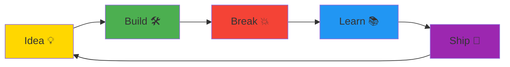

<div align="center">

<!-- Animated Terminal-Style Header -->
```ascii
╔══════════════════════════════════════════════════════════════════════════╗
║                                                                          ║
║  > initializing neural pathways...                                      ║
║  > loading ai architectures...                                          ║
║  > deploying chaos... ✓                                                 ║
║                                                                          ║
║     ██████╗  █████╗ ██████╗ ████████╗██╗  ██╗                          ║
║     ██╔══██╗██╔══██╗██╔══██╗╚══██╔══╝██║  ██║                          ║
║     ██████╔╝███████║██████╔╝   ██║   ███████║                          ║
║     ██╔═══╝ ██╔══██║██╔══██╗   ██║   ██╔══██║                          ║
║     ██║     ██║  ██║██║  ██║   ██║   ██║  ██║                          ║
║     ╚═╝     ╚═╝  ╚═╝╚═╝  ╚═╝   ╚═╝   ╚═╝  ╚═╝                          ║
║                                                                          ║
║  CS Student • ML Engineer • AI Agent Architect                          ║
║  Building intelligent systems that think, learn, and execute            ║
║                                                                          ║
╚══════════════════════════════════════════════════════════════════════════╝
```


</div>

---

## 🧬 Currently Architecting

```python
class AIEngineer:
    def __init__(self):
        self.name = "Parth Parmar"
        self.role = "Machine Learning Engineer"
        self.location = "India 🇮🇳"
        self.philosophy = "Deploy fast. Break things. Learn faster."
        
    def current_focus(self):
        return {
            "building": ["AI Agents", "Financial ML Models", "Voice AI"],
            "learning": ["Advanced NLP", "Multi-Agent Systems", "DeFi"],
            "experimenting": ["RAG Pipelines", "LLM Fine-tuning", "Blockchain ML"]
        }
    
    def deploy_chaos(self):
        while True:
            ship_code()
            break_production()
            learn_from_failures()
            repeat()
```

<br>

---

## 🚀 Live Production Systems

<table>
<tr>
<td width="50%">

### 💼 [Datalis](https://www.datalis.in)
**AI Financial Intelligence Platform**

```typescript
{
  tech: ["NLP", "Time Series", "LLMs"],
  impact: "Real-time market analysis",
  status: "🟢 Production"
}
```

<sub>Turning financial chaos into actionable intelligence</sub>

</td>
<td width="50%">

### 🎙️ [Vocacity](https://vocacity.in)
**AI Voice Agent for Restaurants**

```typescript
{
  tech: ["Voice AI", "NLU", "Dialog Systems"],
  impact: "Automated customer service",
  status: "🟢 Production"
}
```

<sub>Teaching AI to take your dinner orders</sub>

</td>
</tr>
<tr>
<td width="50%">

### ⛓️ [ChainFund](https://chainfundd.vercel.app)
**Cross-Chain Grant Platform**

```typescript
{
  tech: ["Blockchain", "Smart Contracts", "Web3"],
  impact: "Decentralized funding",
  status: "🟡 Beta"
}
```

<sub>Where blockchain meets social impact</sub>

</td>
<td width="50%">

### 🔬 More Projects
**Experimental Lab**

```bash
$ ls -la ~/experiments
> DeNovo/
> UNIDATA/
> Liquidation-Engine/
> [35+ repositories]
```

<sub>The playground where chaos begins</sub>

</td>
</tr>
</table>

---

## ⚡ Tech Arsenal

<div align="center">

**Languages & Frameworks**


**AI/ML Stack**


**Infrastructure**


</div>

---

## 📊 GitHub Intelligence

<div align="center">


<br><br>


</div>

<div align="center">
  
```diff
@@  Activity Stats  @@
+ 31 Public Repositories
+ 14 Followers (and growing)
+ 3 Live Production Systems
! Commits: Classified (too chaotic to count)
```

</div>

---

## 💭 Philosophy

> **"The best way to predict the future is to invent it... and then deploy it to production at 3 AM."**  
> — Parth Parmar (probably)

<br>



---

## 🤝 Let's Connect

<div align="center">

[](https://linkedin.com/in/parthparmar07)
[](https://github.com/parthparmar07)
[](https://www.datalis.in)
[](mailto:your.email@example.com)

<br>

**Open to:**  
💼 ML Engineering Roles | 🚀 AI Startup Collaborations | 🧪 Research Partnerships

</div>

---

<div align="center">

### 🎯 2025 Mission

Building AI systems that don't just work—they **think, adapt, and scale**.  
From financial intelligence to voice automation, one chaotic commit at a time.

<br>


---

<sub>⚡ Powered by coffee, curiosity, and controlled chaos</sub>

</div>
